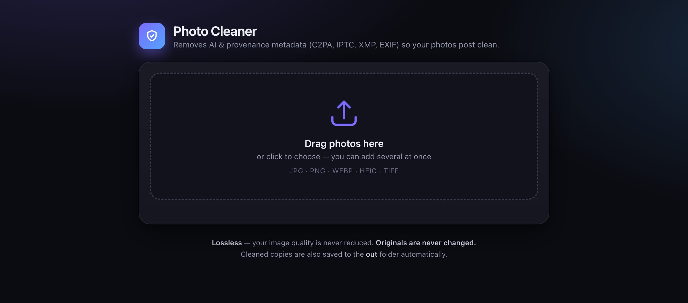

<div align="center">

# 🧼 MetaScrub

### Strip AI & provenance metadata from your photos — local, lossless, private.

Removes **C2PA Content Credentials**, **IPTC `digitalSourceType`**, **XMP**, and **EXIF** tags that cause platforms like Instagram to slap a *"Made with AI" / "AI Info"* label on lightly‑edited or AI‑retouched photos.

[](LICENSE)




</div>

---

## Why this exists

Instagram, Facebook and others don't (only) look at your pixels to decide a photo is AI — they read **metadata that AI tools quietly embed in the file**. A single edit in Photoshop Generative Fill or a redraw in ChatGPT writes a signed **C2PA manifest** and an IPTC `digitalSourceType: trainedAlgorithmicMedia` tag. The platform reads it and labels the post — even when the edit was trivial.

**MetaScrub removes those signals**, losslessly, on your own machine. Nothing is uploaded anywhere.

## ✨ Features

- 🖱️ **Friendly drag‑and‑drop app** — add many photos at once, watch them clean in real time
- 🪶 **Lossless** — JPEG pixels are never re‑encoded; PNG/WebP are re‑encoded losslessly (pixels identical)
- 🧾 **Before/after report** — see exactly which tags were removed on every image
- 🔒 **100% offline** — a tiny local web server; your photos never leave your computer
- 🗂️ **Originals are never touched** — cleaned copies are written to a separate `out/` folder
- ⌨️ **CLI included** — script the same engine for batch jobs
- 🧰 Removes: **C2PA / JUMBF manifests**, **IPTC DigitalSourceType**, **XMP**, **EXIF**, software/author tags

## 📸 Supported formats

`JPG` · `JPEG` · `PNG` · `WebP` · `HEIC` · `TIFF` · `GIF`

## 🚀 Quick start

### Requirements
- **macOS** (Linux works for the CLI too)
- [ExifTool](https://exiftool.org/) and [ImageMagick](https://imagemagick.org/) — install with [Homebrew](https://brew.sh):

```bash
brew install exiftool imagemagick
```

Python 3.9+ is already on macOS — no extra packages needed (standard library only).

### Run the app

```bash
git clone https://github.com/adrozdenko/metascrub.git
cd metascrub
python3 server.py
```

…or just **double‑click `Photo Cleaner.command`** in Finder. The app opens in your browser. Drag photos in, download the clean versions. Done.

### Use the CLI

```bash
./clean.sh                 # clean every image in ./in  -> ./out
./clean.sh ~/Photos        # clean a whole folder       -> ./out
./clean.sh a.jpg b.png     # clean specific files       -> ./out
```

Each run prints a per‑file before/after report.

## 🔍 How it works

| Format | Method | Quality |
|--------|--------|---------|
| **JPEG / HEIC** | `exiftool -all=` — strips every metadata block, pixels untouched | 🟢 Lossless (no re‑encode) |
| **PNG / WebP / TIFF** | `magick … -strip` re‑encode (drops C2PA chunks) + `exiftool -all=` | 🟢 Lossless (pixels identical) |

The app exposes a minimal local HTTP server (`server.py`, stdlib only). The browser posts each image's bytes to `/clean`; the server runs the tools above, writes a clean copy to `out/`, and returns the result for preview and download. No frameworks, no telemetry, no cloud.

## ⚠️ What this can — and can't — do (read this)

MetaScrub removes **metadata**, which is the confirmed signal platforms use for the auto AI‑label. It does **not** remove **pixel‑level invisible watermarks** such as Google **SynthID** or **Trufo**, which some generators (e.g. OpenAI's `gpt-image`, Google's Imagen/Gemini) bake directly into the image data. Those survive metadata removal, re‑encoding, cropping and compression by design.

> **If you must avoid AI detection entirely, retouch with a non‑generative tool** (Lightroom, Photoshop manual edits, Capture One, Topaz) instead of regenerating the image — then no watermark and no `trainedAlgorithmicMedia` tag is ever added in the first place.

This tool is intended for legitimate privacy and metadata‑hygiene use. Be honest about AI‑generated content where disclosure is required.

## 🗂️ Project structure

```
metascrub/
├── Photo Cleaner.command   # double‑click launcher (macOS)
├── server.py               # local web server + cleaning engine (stdlib only)
├── index.html              # the UI (dark theme)
├── clean.sh                # CLI batch cleaner
├── in/                     # drop photos here (CLI) — git‑ignored
└── out/                    # cleaned copies land here — git‑ignored
```

## 🤝 Contributing

Contributions are welcome! See [CONTRIBUTING.md](CONTRIBUTING.md). Ideas: Windows/Linux launchers, a native menu‑bar build, video metadata support, watermark‑detection reporting.

## 📄 License

[MIT](LICENSE) © 2026 Andrii Drozdenko
